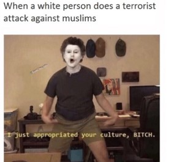
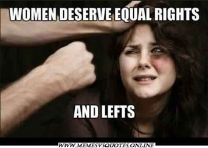
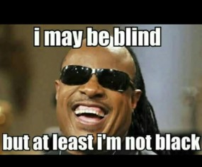
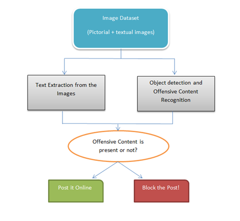

# Minor-Project
# Offensive  Image  Content Detection System through Text Extraction and Image Processing

## **Indira Gandhi Delhi Technical University for Women (Semester - 7)** 

### Team Members-
<ul>
 <li>Aiman Fatima</li>
 <li>Vaidehi Gupta</li>
 <li>Shally Kumar</li>
 <li>Kanishka Arora</li>
</ul>

## Project Description

### Problem Statement

One of the main problems of the Internet is the presence of harmful (e.g. pornographic) or even illegal (e.g. pedophilic) contents which is not suitable for all age groups. The amount of this non-desired material is growing at an increasing rate.
To design a system which would detect the offensive image and text content present in the form of an image against social media standards and block them from posting on any social media platform.

## Different forms of Offensive content with examples

### There are three possibilties for the presence of offensive content in an image-

<ol>
   
 <li> <b>Offensive text in a normal image</b>
        
      
 </li>
   
 <li> <b>Offensive image with normal text</b> 
        
      
 </li>
   
 <li> <b>Both image and text are offensive</b>
        
      
 </li>
   
</ol>

## Proposed Workflow

   

    

